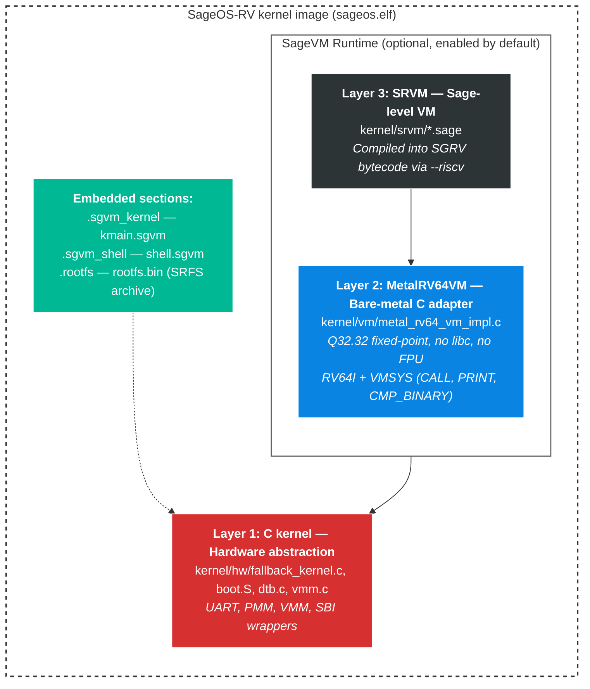
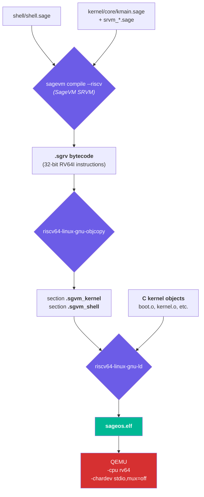

# SageOS-RV


**A pure-Sage operating system for RISC-V 64.**  
Target hardware: LicheeRV Nano W (Sophgo SG2002 + AIC8800 WiFi 6). Development platform: QEMU `virt`.

---

## Architecture Overview

SageOS-RV uses a layered architecture with optional SageVM runtime:



### Two Operating Modes

| Mode | Build | Description |
|---|---|---|
| C-only (default) | `./sagemake build` | Direct C kernel with UART echo loop — fast build, no SageVM dependency |
| Full SageVM | `SAGEVM_ENABLED=1 ./sagemake build` | Sage kernel → MetalRV64VM → Sage shell with `readline()` |

### Compilation Flow



---

## Quick Start

### Prerequisites

```bash
sudo apt install gcc-riscv64-linux-gnu binutils-riscv64-linux-gnu
sudo apt install qemu-system-misc opensbi
# SageVM: https://github.com/Night-Traders-Dev/SageVM
```

### Build and Run

```bash
git clone --recurse-submodules https://github.com/Night-Traders-Dev/SageOS-RV
cd SageOS-RV

./sagemake build          # C-only kernel (default, fast)
./sagemake qemu           # boot in QEMU

# Full SageVM build:
SAGEVM_ENABLED=1 ./sagemake build

# Board-specific builds:
BOARD=licheerv-nano ./sagemake build
```

### Expected Boot Output

```
SBIK!
[SageOS] Booting...

========================================
  SageOS-RV v0.3.0
  Pure Sage Operating System
  RISC-V 64 | QEMU virt
========================================

[1/5] Console:   16550A UART ready
[2/5] Memory:    PMM bump allocator ready
[3/5] dmesg:     diagnostic log buffer @ 0x87010000
[4/5] Watchdog:  armed (DesignWare WDT, 1s timeout)
[5/5] SageRTOS:  pure-Sage scheduler v2.0
     Error Hdl:  kernel panic handler v1.0 (watchdog-integrated)

[MetalRV64] Running shell...
[OK] MetalRV64: shell loaded

SageOS-RV Shell — type 'help' for commands

sage# help
Commands: help version about clear dmesg ls mem ps halt
```

---

## sagemake Commands

| Command | Description |
|---|---|
| `build` | Full build: boot + kernel + MetalRV64 + SGRV blobs + rootfs |
| `clean` | Remove build artifacts |
| `qemu` | Launch QEMU with interactive shell |
| `build-run` | `build` then `qemu` |
| `flash` | Write kernel image to SD card for physical boot |
| `test` | Run automated test suite |
| `compile-kernel` | `sagevm compile kernel/core/kmain.sage kernel/core/kmain.sgvm --riscv` |
| `run-kernel` | `sagevm run kernel/core/kmain.sgvm --riscv` |
| `compile-shell` | `sagevm compile shell/shell.sage shell/shell.sgvm --riscv` |
| `run-shell` | `sagevm run shell/shell.sgvm --riscv` |
| `setup-srvm` | Copy SRVM sources from SageVM submodule |
| `setup-metalvm` | Validate MetalVM headers |
| `version` | Print toolchain versions |

Board selection: `BOARD=licheerv-nano ./sagemake build`  
SageVM enable: `SAGEVM_ENABLED=1 ./sagemake build`

---

## Repository Layout

```
SageOS-RV/
├── boot/arch/rv64/
│   ├── boot.S                    Bare-metal entry (OpenSBI S-mode handoff)
│   ├── linker.ld                 QEMU virt memory layout
│   └── linker-licheerv.ld        LicheeRV Nano memory layout
├── kernel/
│   ├── core/                     Kernel core (Sage)
│   │   ├── kmain.sage            Kernel entry + init banner
│   │   ├── panic.sage            Verbose kernel panic (watchdog-integrated)
│   │   └── errors.sage           Error code registry (11 subsystems)
│   ├── vm/                       MetalVM implementations (C)
│   │   ├── metal_vm.h/c          Stack VM + value constructors
│   │   └── metal_rv64_vm.h/c     RV64 register VM (1170 lines, freestanding)
│   ├── srvm/                     SRVM module sources (Sage, from SageVM)
│   │   ├── srvm_core.sage        SRVM core: opcodes, encoding
│   │   └── srvm_vm.sage          SRVM VM: bytecode interpreter
│   ├── hw/                       Hardware abstraction (C + Sage)
│   │   ├── fallback_kernel.c     C boot kernel + MetalRV64 dispatch
│   │   ├── dtb.c/h + dtb.sage    Device tree parser (C + Sage port)
│   │   ├── vmm.c/h               SV39 virtual memory (C)
│   │   ├── sbi.h + sbi.sage      SBI ecall wrappers (C + Sage)
│   │   └── *.sage                Sage ports of C hardware modules
│   ├── rtos/                     SageRTOS
│   │   └── sagertos.sage         Pure-Sage cooperative scheduler
│   ├── net/                      Network stack (pure Sage)
│   │   ├── stack.sage            TCP/IP: ETH, ARP, IPv4, ICMP, UDP, TCP
│   │   ├── dhcp.sage             DHCP client
│   │   └── wifi_net.sage         WiFi-to-network bridge
│   ├── crypto/                   Cryptographic library (pure Sage)
│   │   ├── sha256.sage           SHA-256 (FIPS 180-4 compliant)
│   │   └── hmac.sage             HMAC-SHA256 (RFC 2104)
│   ├── ssh/                      SSH client (pure Sage)
│   │   ├── ssh_client.sage       SSH-2.0 client (RFC 4251-4254)
│   │   └── cluster_monitor.sage  Multi-node RAM monitor
│   ├── vfs.sage                  Virtual File System
│   ├── rootfs.sage               Embedded rootfs driver (SRFS)
│   ├── dmesg.sage                Persistent diagnostic log
│   └── vmm.sage                  Pure-Sage SV39 page table walker
├── shell/
│   ├── shell.sage                Interactive shell (readline + command dispatch)
│   └── shell.sgvm                Compiled SGRV bytecode
├── drivers/
│   ├── bus/                      I2C, SPI bus drivers
│   ├── gpio/                     GPIO driver (DesignWare, 4 banks)
│   ├── wifi/                     WiFi: AIC8800, ESP-AT, abstraction layer
│   ├── sys/                      PLIC, timer, watchdog, syscon
│   ├── uart/                     16550A UART driver
│   ├── fs/                       ext4, FAT32 filesystem drivers
│   └── boards/                   Board support packages (licheerv.sage)
├── rootfs/                       Default rootfs files
├── tests/                        Test suite (shell, drivers, panic)
├── tools/                        Build tools (mkrootfs.sh)
├── config/
│   ├── build.conf                Build configuration
│   └── boards/                   Board-specific configs
├── deps/
│   └── SageVM/                   SageVM submodule (SRVM + compiler)
├── docs/                         Documentation
├── sagemake                      Build system
└── VERSION
```

---

## Key Features

### MetalRV64 VM

All Sage code runs through a bare-metal RISC-V register VM:
- **Freestanding** — no libc, no malloc, no FPU. `-nostdlib -ffreestanding`
- **Q32.32 fixed-point** — numbers as `int64_t`, no IEEE 754 dependency
- **RV64I + VMSYS** — LUI, AUIPC, JAL, JALR, BRANCH, ALU, LOAD/STORE, LDC, VMSYS
- **Builtins** — readline, streq, shell_exec, mem_write/read, array, push, len, wdog_kick
- **VMO_CMP_BINARY** — string and number comparisons (EQ/NEQ/LT/GT/LE/GE)
- **Static pools** — arrays, dicts, strings, constants all pre-allocated

### Interactive Shell

Built-in commands via `shell_exec()` builtin (dispatched in C for reliable string comparison):
- `help`, `version`, `about`, `clear`, `dmesg`, `ls`, `mem`, `ps`, `halt`
- `readline()` with per-character echo, backspace support, UART polling via `wfi`

### Error Handling & Kernel Panic

11 subsystems, 4 severity levels, watchdog-integrated panic handler:
- Box-drawn diagnostic with error code, subsystem, description, suggested fix
- Watchdog armed at boot, stops kicking on panic → auto-reset in ~1.3s
- `panic()`, `warn()`, `assert()`, `assert_not_null()` API

### Filesystem Support

- **VFS** — mount points, path resolution, FD table, open/read/close/seek
- **RootFS** — embedded SRFS archive, read-only, `ls` and `cat` support
- **ext4** — full driver (superblock, inodes, extent trees, directory parsing)
- **FAT32** — full driver (MBR, BPB, FAT chain, 8.3 names)

### Device Drivers (Pure Sage)

| Driver | Hardware | API |
|---|---|---|
| `uart16550a.sage` | 16550A UART | init, putc, getc, puts, put_dec, put_hex |
| `gpio.sage` | DesignWare GPIO | write, read, toggle, mode, LED helpers |
| `i2c.sage` | DesignWare I2C | init, write_bytes, read_bytes, scan |
| `spi.sage` | DesignWare SPI | init, transfer, write_read, cs_enable |
| `plic.sage` | RISC-V PLIC | init, enable, disable, claim, complete |
| `syscon.sage` | SG2002 SysCon | reset, shutdown, chip ID |
| `timer.sage` | mtime/mtimecmp | init, poll, delay_us/ms |
| `watchdog.sage` | DesignWare WDT | init, kick, disable, timeout presets |
| `wifi_aic8800.sage` | AIC8800D WiFi 6 | SDIO transport, firmware load, scan/connect |

### Networking (Pure Sage)

- **TCP/IP stack** — Ethernet, ARP, IPv4, ICMP, UDP, TCP
- **DHCP client** — DISCOVER → OFFER → REQUEST → ACK
- **WiFi integration** — connect + DHCP + interface config in one call
- **SSH client** — SSH-2.0 protocol (RFC 4251-4254): KEX, auth, channels, command exec
- **Crypto library** — SHA-256 (FIPS 180-4), HMAC-SHA256 (RFC 2104)
- **Cluster monitor** — SSH into 3 nodes, check RAM, run cleanup when below 20%

### C → Sage Porting Progress

| C Source | Lines | Sage File | Status |
|---|---|---|---|
| `dtb.c` | 188 | `kernel/hw/dtb.sage` | Complete |
| `vmm.c` | 90 | `kernel/vmm.sage` | Complete |
| `sbi.h` | 116 | `kernel/hw/sbi.sage` | Complete |
| `sagertos_rv64.c` | 360 | `kernel/rtos/sagertos.sage` | Complete |
| **Total ported** | **754** | **662** | 4 files |

Dead code removed: `kernel/metalvm/` (2,800 lines hosted reference, never compiled).

---

## Known Limitations

- **AIC8800 WiFi**: Requires firmware blob embedded in kernel image for full operation.
- **Preemptive RTOS**: Cooperative only — timer interrupt → context switch needs C/asm bridge.
- **Hardware testing**: LicheeRV Nano W not yet tested on physical hardware.

---

## License

See [LICENSE](LICENSE).
