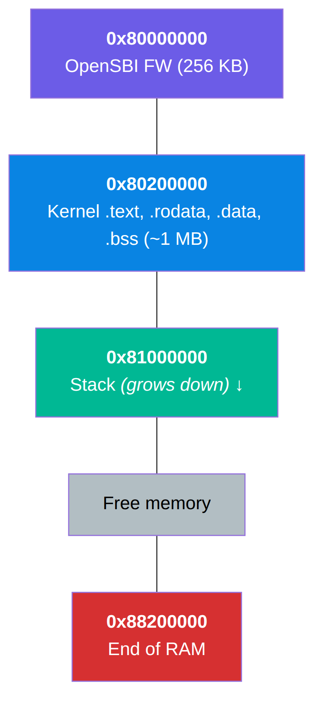

# SageOS-RV Kernel Architecture

## Overview

SageOS-RV boots on RISC-V 64 in S-mode with OpenSBI as the M-mode firmware.
The kernel is loaded at physical address `0x80200000` by OpenSBI's dynamic
firmware loader. Execution begins in `boot.S`, then transitions to the
Sage/C kernel's `sage_kernel_main()`.

## Memory Layout



## Boot Flow

### 0. Device Tree Probe

`boot/start.sage` calls `dtb_parse()` at runtime before handoff, extracting:
- `mem_base` / `mem_size` — DRAM base and size from `/memory`
- `uart_base` — 16550A UART MMIO address from `/soc/serial`

This replaces the previously hardcoded QEMU addresses. The DTB is parsed and its values override the compiled-in defaults.

### Board-Aware UART Fallback

If `uart_base` is still `0` after DTB probe, board-specific `#ifdef` fallbacks apply:

| Board | Fallback UART | Fallback RAM | Fallback Timer |
|---|---|---|---|
| QEMU virt (default) | `0x10000000` | 128 MB | 10 MHz |
| LicheeRV Nano | `0x04140000` | 256 MB | 25 MHz |

The fallback logic lives in `boot/arch/rv64/boot.S` (assembly) and `kernel/hw/fallback_kernel.c` (C), both using `#ifdef CONFIG_BOARD_LICHERV_NANO`.

### 1. OpenSBI (M-mode)

- Power-on reset at `0x80000000`
- Initializes platform (clint, uart, pmp)
- Configures PMP regions for S/U access
- Sets `mideleg` / `medeleg` to delegate interrupts and traps to S-mode
- Installs SBI v3.0 handler
- `mret` to `0x80200000` in S-mode

### 2. boot.S (S-mode)

```
_start:
  li   sp, 0x81000000         # Set up C stack
  # SBI putchar for early boot messages
  li   a7, 1; li a0, 'S'; ecall
  ...

  # UART base — board-aware via linker symbol or #ifdef
  lui  t0, %hi(uart_base)
  addi t0, t0, %lo(uart_base)
  sb   zero, 1(t0)            # IER = 0 (disable IRQs)
  ...

  # Clear BSS
  la   t0, _bss_start
  la   t1, _bss_end
  ...

done:
  call sage_kernel_main       # Enter kernel
```

Key details:
- Uses `sb`/`lbu` (byte) accesses for the 16550A UART registers
- SBI ecall putchar for initial boot messages (guaranteed in S-mode)
- Direct UART init + polling for kernel console
- UART base resolved from DTB probe result or board-specific `#ifdef`

### 3. Kernel Initialization (fallback_kernel.c)

```
sage_kernel_main():
  [1a]  dtb_parse() → fills mem_base/mem_size/uart_base
  [1b]  uart_init(uart_base)   → 16550A, byte MMIO
  [2]   metal_rv64_vm_init()   → zero MetalRV64VM pools
  [3]   wire write_char/read_char callbacks
  [4]   metal_rv64_vm_load_binary() → parse SGRV binary
  [5]   for each chunk:         → register function bindings
          metal_rv64_vm_run()
  [6]   shell dispatch         → (when kernel globals are available)
```

The dmesg output reports the UART base dynamically: `"UART @ 0x%08x"` instead of a hardcoded string.

### DTB Fallback Defaults

`kernel/hw/dtb.c` provides compile-time defaults when no DTB is provided:

| Board | mem_size | clock_freq | uart_base |
|---|---|---|---|
| QEMU virt | 128 MB (0x08000000) | 10 MHz (10000000) | 0x10000000 |
| LicheeRV Nano | 256 MB (0x10000000) | 25 MHz (25000000) | 0x04140000 |

The board selection is via `CONFIG_BOARD_LICHERV_NANO`. The Sage wrapper `kernel/hw/dtb.sage` provides a `dtb_parse()` function that reads `/memory/reg` and `/cpus/timebase-frequency` from the device tree at runtime, overriding these defaults.

### Interrupt Controller

The kernel uses SBI TIME extension for timer interrupts (portable across QEMU and LicheeRV) instead of directly accessing CLINT registers. This removes the dependency on hardcoded CLINT base addresses. See `kernel/interrupt.sage` and `kernel/hw/sbi.sage` for details.

## SBI Wrappers

The kernel communicates with OpenSBI via the SBI (Supervisor Binary Interface).
Wrappers are defined in `kernel/sbi.h`.

| Function            | Extension | EID           | FID | Args           |
|---------------------|-----------|---------------|-----|----------------|
| sbi_console_putchar | Legacy    | 0x01          | —   | char           |
| sbi_console_getchar | Legacy    | 0x02          | —   | —              |
| sbi_set_timer       | TIME      | 0x54494D45    | 0   | stime_value    |
| sbi_system_reset    | SRST      | 0x53525354    | 0   | type, reason   |
| sbi_shutdown        | SRST      | 0x53525354    | 0   | SHUTDOWN=0     |
| sbi_cold_reboot     | SRST      | 0x53525354    | 0   | COLD_REBOOT=1  |
| sbi_warm_reboot     | SRST      | 0x53525354    | 0   | WARM_REBOOT=2  |

Calling convention:
- `a7` = extension ID (EID)
- `a6` = function ID (FID)
- `a0`-`a5` = arguments
- Return: `a0` = error code, `a1` = value

## UART Driver

The kernel uses a 16550A-compatible UART whose base address is determined at runtime:

| Board | UART Base | UART Clock |
|---|---|---|
| QEMU virt | `0x10000000` | 10 MHz |
| LicheeRV Nano | `0x04140000` (UART0 on SG2002) | 25 MHz |

The VMM (`kernel/vmm.sage`) identity-maps **both** regions (`0x10000000` and `0x04140000`) so either address is accessible from S-mode regardless of board target.

### Register Map (byte offsets)

| Offset | Register | Access | Description        |
|--------|----------|--------|--------------------|
| 0      | THR/RBR  | W/R    | Transmit / Receive |
| 1      | IER      | W      | Interrupt Enable   |
| 2      | FCR      | W      | FIFO Control       |
| 3      | LCR      | W      | Line Control       |
| 5      | LSR      | R      | Line Status        |

All accesses are **byte-wide** (`volatile uint8_t*`).

## Shell

The shell supports:

| Command    | Description                          |
|------------|--------------------------------------|
| `help`     | List commands                        |
| `version`  | Kernel version + SBI info            |
| `mem`      | Memory statistics (pages, KB)        |
| `uptime`   | Timer ticks since boot               |
| `reboot`   | SBI SRST cold reboot                 |
| `poweroff` | SBI SRST shutdown                    |
| `halt`     | WFI loop (local halt)                |
| `clear`    | ANSI escape clear screen             |
| `echo`     | Print arguments                      |

Input polling interleaves UART `LSR.DR` checks with SBI `console_getchar`
and periodic `timer_poll()` to keep `uptime` accurate.

## Known Issues

### LicheeRV Nano — Untested on Hardware

All 12 identified boot gaps (UART base, DTB fallback, VMM identity map, CLINT
→ SBI TIME, DTS, clkgen, PMIC, AIC8800 IPC, qemu-virt BSP) are closed in code,
and both `BOARD=qemu-virt` and `BOARD=licheerv-nano` builds compile cleanly.
However, the LicheeRV Nano image has not been tested on physical hardware yet.

### Kernel Global Initialization

The kernel Sage code (`kernel/core/kmain.sage`) uses two-phase initialization
to resolve symbols natively. The MetalRV64 VM registers built-ins via C during
initialization.

### SageVM --riscv SGRV Format

The SGRV binary format uses `funct3=2` (OBJ_OPS) for object/global operations
with a register-bind convention (VMSYS sub_op=0 copies x10 to rd). The
stack-based MetalVM SGVM format (funct3-based dispatch) is mutually exclusive.
