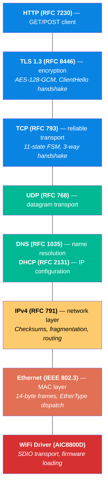
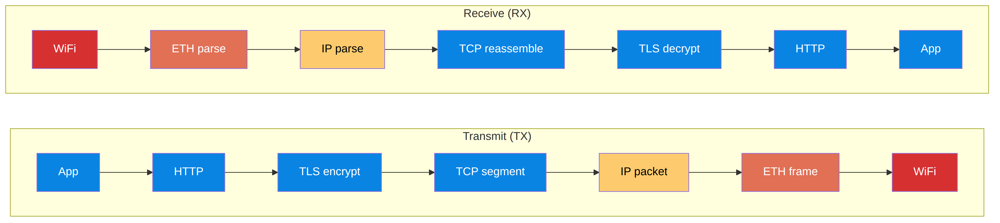
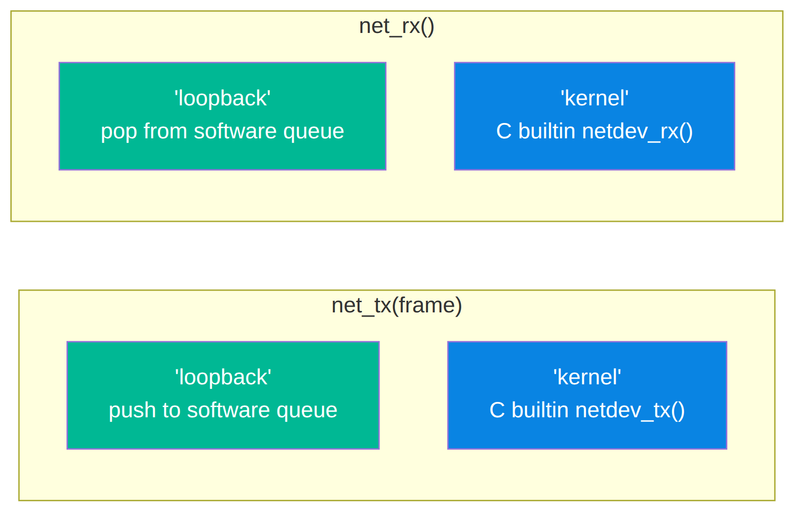
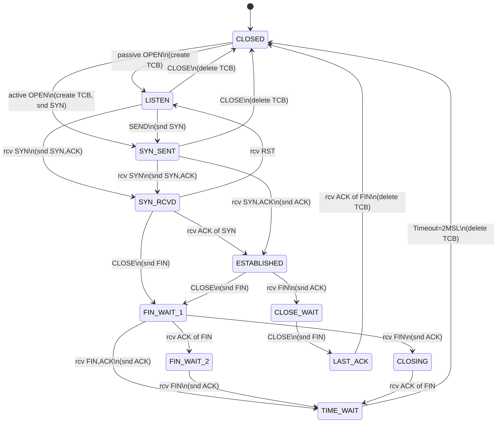

# Network Stack — Architecture

SageOS-RV includes a full pure-Sage TCP/IP network stack in `kernel/net/`.

---

## Protocol Layers



## Data Flow



## WiFi Integration

The full pipeline is wired:

```sage
# 1. Connect WiFi
a = aic_wifi_connect("MyWiFi", "password")

# 2. Get IP via DHCP
dhcp_discover()
ip = dhcp_get_ip()           # 192.168.1.100

# 3. Resolve DNS
answers = dns_resolve("example.com", "8.8.8.8")

# 4. HTTP GET
req = http_request("GET", "example.com", "/")
# Pipeline: http → tls_encrypt → tcp_build → ip_build → eth_build
```

## Protocol Files

| File | Lines | Protocol | Key Features |
|---|---|---|---|
| `ethernet.sage` | 50 | IEEE 802.3 | Frame build/parse, EtherType, broadcast |
| `ipv4.sage` | 60 | RFC 791 | Checksum, fragmentation, TTL, routing |
| `tcp.sage` | 150 | RFC 793 | 11-state FSM, 3-way handshake, TCB, graceful close |
| `udp.sage` | 20 | RFC 768 | Datagram build/parse, port numbers |
| `dns.sage` | 65 | RFC 1035 | A record query, name encoding, reply parse |
| `dhcp.sage` | 50 | RFC 2131 | DORA cycle, IP/mask/gw/DNS extraction |
| `http.sage` | 70 | RFC 7230 | GET/POST, header parsing, status codes |
| `tls.sage` | 60 | RFC 8446 | ClientHello, cipher suite negotiation, AES-128-GCM |
| `wifi_net.sage` | 40 | — | WiFi→Net bridge, scan→connect→DHCP→IP |
| `stack.sage` | 120 | — | Full TCP/IP stack integration (legacy) |
| `tcp_stack.sage` | 595 | RFC 9293 | Transport-agnostic TCP/IP stack; Ethernet→ARP→IPv4→TCP socket API |

## Transport Architecture

The `tcp_stack.sage` (used by SSH command) is transport-agnostic — it does not depend on any specific NIC:



| Backend | Selector | Purpose |
|---|---|---|
| **loopback** | `let net_backend = "loopback"` | Host-side testing — frames queued in Sage arrays |
| **kernel** | `let net_backend = "kernel"` | VM-to-NIC — delegates to C `netdev_tx`/`netdev_rx` builtins |

### QEMU Virtio-Net Backend

When running under QEMU `virt` with `net_backend = "kernel"`:

1. **MetalRV64 VM** registers `netdev_tx`, `netdev_rx`, `netdev_now` builtins (`metal_rv64_vm_impl.c` lines 996-1019)
2. **Network config** (`net_our_ip`, `net_our_mac`) is set in the command's global dict before execution (lines 949-963)
3. **TX path**: Sage `net_tx(frame)` → C `netdev_tx()` copies to a global TX buffer `g_net_tx_buf[]`
4. **RX path**: Sage `net_rx()` → C `netdev_rx()` returns `nil` (stub — awaiting full virtio-net driver)

The pure-Sage virtio-net driver (`kernel/drivers/net/virtio_net.sage`) provides virtqueue ring management for frame submission. See [docs/virtio-net.md](virtio-net.md).

## TCP State Machine



## Test Suite

```bash
python3 tests/net_test.py
# 64/64 tests pass — validates all protocol constants, checksums, state machines
```

Output validates against:
- IEEE 802.3 frame format
- RFC 791 IPv4 header + checksum computation
- RFC 793 TCP 11-state machine + flag bits
- RFC 768 UDP datagram format
- RFC 1035 DNS query structure
- RFC 2131 DHCP message types + DORA cycle
- RFC 7230 HTTP/1.1 request format
- RFC 8446 TLS 1.3 handshake + cipher suite
