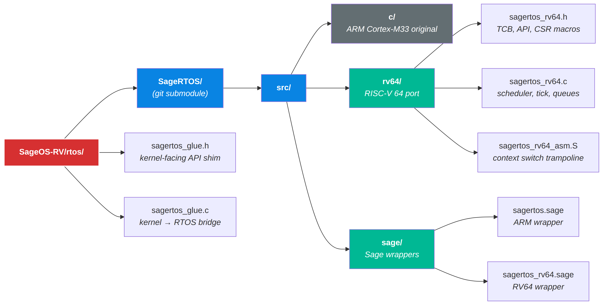
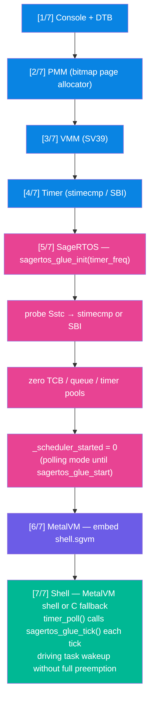

# SageRTOS — RISC-V 64 Integration

SageOS-RV uses [SageRTOS](https://github.com/Night-Traders-Dev/SageRTOS) as a Git submodule at `rtos/SageRTOS`. The RTOS provides preemptive multitasking, software timers, message queues, and mutexes — all in a bare-metal, libc-free implementation.

---

## Repository Layout



---

## Architecture: ARM vs RV64 Port

The original `src/c/sagertos.c` targets ARM Cortex-M33. It uses hardware mechanisms that do not exist on RISC-V:

| Mechanism | ARM Cortex-M33 | RISC-V 64 (this port) |
|---|---|---|
| Context switch trigger | PendSV (`ICSR = PENDSVSET`) | Direct call to `sagertos_rv64_context_switch()` from tick handler |
| Stack register | PSP (`mrs psp` / `msr psp`) | `sp` (regular ABI register) |
| Saved registers | R4–R11 + LR (hardware auto-saves R0–R3, R12, LR, PC, xPSR) | `ra` + `s0–s11` (callee-saved per RV64 ABI; caller-saved are the task’s responsibility) |
| Timer tick | SysTick ISR | stimecmp interrupt (Sstc ext) or SBI `set_timer` fallback |
| Privilege mode | Cortex-M exception model | RISC-V S-mode (`sie.STIE`, `sip.STIP`) |

---

## Context Switch Internals

The trampoline lives in `src/rv64/sagertos_rv64_asm.S`. The saved context frame is 13 × 8 bytes on the task’s own stack:

```
sp+0*8   ra     ← where this task resumes on next restore
sp+1*8   s0/fp
sp+2*8   s1
 ...     s2–s11
sp+12*8  s11
```

The TCB stores only `sp` (the saved stack pointer after the push). On a switch:

1. Push frame onto current task’s stack, save `sp` into `current->sp`.
2. `current = next_task`.
3. Load `sp` from `next->sp`, pop frame, `ret` → jumps to saved `ra`.

This is equivalent to ARM’s PendSV handler but implemented entirely in software with no hardware assist.

---

## Timer Tick Source

At init, `sagertos_rv64_init()` probes for the Sstc extension by writing and reading back `stimecmp` (CSR `0x14D`). If the readback matches, `stimecmp` is used directly (lower latency, no ecall). Otherwise it falls back to `sbi_set_timer()` via ecall.

The kernel’s existing `timer_poll()` in `fallback_kernel.c` now calls `sagertos_glue_tick()` on every tick interrupt, which drives `sagertos_rv64_tick_handler()` — waking sleeping tasks and running the scheduler.

---

## Glue Layer

`rtos/sagertos_glue.h` provides a minimal, stable interface so the kernel does not need to include RTOS internals directly:

```c
void sagertos_glue_init(uint64_t timer_freq_hz);  /* call after PMM + timer */
void sagertos_glue_tick(void);                    /* call from timer ISR */
int  sagertos_glue_task_create(fn, arg, stack, prio);
void sagertos_glue_start(void);                   /* hand CPU to scheduler */
int  sagertos_glue_ready(void);                   /* 1 after init */
```

When `SAGE_RTOS` is not defined (RTOS sources absent), every function becomes a no-op static inline — the kernel compiles and boots identically without the submodule.

---

## Boot Sequence with RTOS



Full preemption (tasks running concurrently) is enabled by calling `sagertos_glue_start()`, which calls `sagertos_rv64_start()` and never returns. The current boot model keeps the C shell in control and ticks the RTOS cooperatively; full preemptive scheduling is the next milestone.

---

## Quick Start

```bash
# First time: initialise the submodule
./sagemake setup-rtos

# Build with RTOS
./sagemake build

# At the shell prompt:
sage# rtos
SageRTOS RV64:
  Status: active
  Port:   rv64imac S-mode
  Tick:   stimecmp (1 ms logical)
  Sched:  fixed-priority round-robin
  Switch: ra+s0-s11 save/restore (asm.S)
```

---

## Creating Tasks from Sage

Once `sagertos_rv64.sage` is compiled to `.sgvm`, tasks can be created from Sage:

```sage
let rtos = SageRTOS_RV64(timer_freq=10000000)

rtos.task_create("heartbeat", proc(arg):
    while true:
        uart.puts("tick\n")
        rtos.sleep(1000)
end, nil, 256, 1)

rtos.task_create("idle", proc(arg):
    while true: rtos.sleep(100) end
end, nil, 256, 15)

rtos.start()  ## never returns
```

---

## Compile Flags

| Flag | Purpose |
|---|---|
| `-DSAGE_RTOS` | Enable RTOS glue layer and link RTOS objects |
| `-DSAGE_BARE_METAL` | Suppress any libc assumptions in RTOS sources |
| `-march=rv64imac_zicsr_zifencei` | Required for CSR instructions and `rdtime` |
| `-nostdlib -ffreestanding` | No libc, no startup files |
