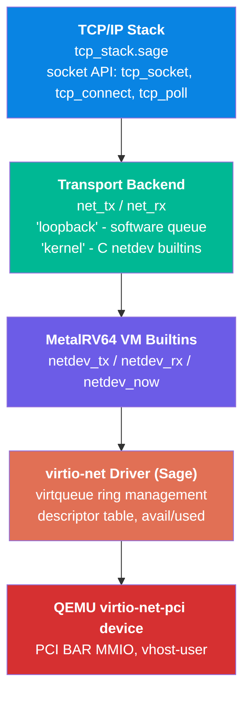

# Virtio-Net Driver

SageOS-RV includes a pure-Sage virtio-net driver for QEMU's virtual NIC, providing a transport layer for the TCP/IP stack when running under QEMU `virt`.

---

## Architecture



## Transport Backend

The TCP stack (`kernel/net/tcp_stack.sage`) is transport-agnostic. Two backends are supported:

| Backend | `let net_backend =` | Description |
|---|---|---|
| **loopback** (default) | `"loopback"` | Frames queued in software for host-side testing |
| **kernel** | `"kernel"` | Delegates to C VM builtins wired to a real NIC |

When `net_backend = "kernel"`, the stack calls `net_tx()` and `net_rx()` which invoke the corresponding MetalRV64 VM builtins:

- `netdev_tx(frame)` — queue a raw Ethernet frame
- `netdev_rx()` — return a received frame (or nil)
- `netdev_now()` — monotonic clock in ms (reads QEMU `mtime`)

### Network Configuration

The host harness (or the MetalRV64 kernel) sets these variables in the command's global dict before running:

| Variable | Example Value | Description |
|---|---|---|
| `net_backend` | `"kernel"` | Transport backend selector |
| `net_our_ip` | `0x0A00020F` (10.0.2.15) | QEMU guest IP address |
| `net_our_mac` | `[0x52,0x55,0x0A,0x00,0x00,0x01]` | MAC address bytes |

These are set via `rv_dict_set` in `metal_rv64_vm_impl.c` (lines 949-963) before the command bytecode runs.

## C Builtins (`metal_rv64_vm_impl.c`)

Three builtins registered at line 996-1019:

- **`netdev_now`** — reads `mtime` register at QEMU MMIO address `0x0200BFF8`, divides by 10000 to get ms
- **`netdev_tx`** — pops a Sage array from `x[10]`, copies bytes to a global TX buffer `g_net_tx_buf[]`
- **`netdev_rx`** — returns `nil` (stub — no real RX yet; awaits full virtio-net driver)

### TX Path (stub)

```
Sage: net_tx(frame) → C: netdev_tx(frame)
  → copy array bytes to g_net_tx_buf[]
  → set g_net_tx_len
  → future: DMA to virtio-net virtqueue
```

### RX Path (stub)

```
Sage: frame = net_rx() → C: netdev_rx()
  → returns nil
  → future: pull from virtio-net used ring
```

## Sage Virtio-Net Driver (`kernel/drivers/net/virtio_net.sage`)

The pure-Sage driver skeleton implements:

| Function | Description |
|---|---|
| `virtio_net_init()` | Initialize driver state, called during kernel boot |
| `virtio_net_configure(pci_bar0, pci_bar1, notify_addr)` | Configure virtqueue rings from PCI BAR memory |
| `virtio_net_tx(frame)` | Submit frame to virtqueue descriptor table |
| `virtio_net_rx()` | Extract completed frame from used ring |
| `virtio_net_poll()` | Process completed descriptors, ring doorbell |

### Virtqueue Ring Management

```
virtq_desc[256]  — Descriptor table (each 16 bytes: addr, len, flags, next)
virtq_avail[256] — Available ring (driver→device)
virtq_used[256]  — Used ring (device→driver)
```

## QEMU Configuration

To enable virtio-net in QEMU, add to the QEMU command line:

```bash
-device virtio-net-pci,netdev=net0 \
-netdev user,id=net0
```

Or for vhost-user:

```bash
-chardev socket,id=vhost0,path=/tmp/qemu-vhost.sock,server,nowait \
-netdev type=vhost_user,id=net0,vhostforce \
-device virtio-net-pci,netdev=net0,mq=2,vectors=8
```

## Files

| File | Lines | Description |
|---|---|---|
| `kernel/drivers/net/virtio_net.sage` | 91 | Pure-Sage virtio-net driver |
| `kernel/vm/metal_rv64_vm_impl.c` | 1556 | C builtins: netdev_tx, netdev_rx, netdev_now |

## Known Limitations

- `netdev_rx` returns `nil` — no real frame reception yet
- Virtio-net driver is a skeleton: virtqueue management functions allocate but do not perform actual MMIO/PIO to QEMU
- No interrupt handling or MSI-X support
- Only tested under QEMU `virt` (not physical hardware)
